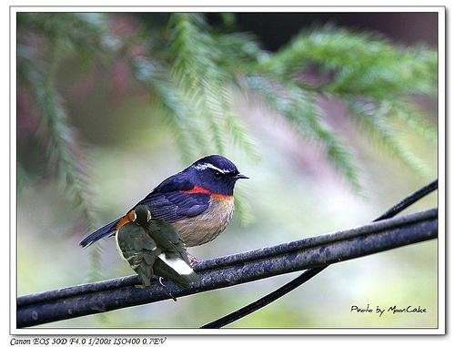

# Synthetic-Splicing-Tamper-DatSets
A splicing tamper dataset composed of PASCAL VOC2012 datasets

Complete the following steps：

1) Random objects are selected from the segmentation and annotation information of Pascal VOC 2012 dataset as the tampering region;

2) The tampering area selected in the above steps is randomly spliced onto other images of the data set;

3) Modify the annotation file corresponding to the composite image according to the position information of the boundary box in Step 1 and the position of the tampering area in the composite image, and modify the detection category to "Splicing";

4) The position information of the boundary box in the composite image is changed into the position information of the tampered area in the composite image, and the modified annotated content is taken as the final annotated file information of the composite image.

examples:

## Contact

For any datasets related questions, please contact `zheng_liu0307@hotmail.com

For the full picture, [click here！](链接：https://pan.baidu.com/s/1gnscXCWQkVGKyNoh-OkEew ) Download code: 42kd